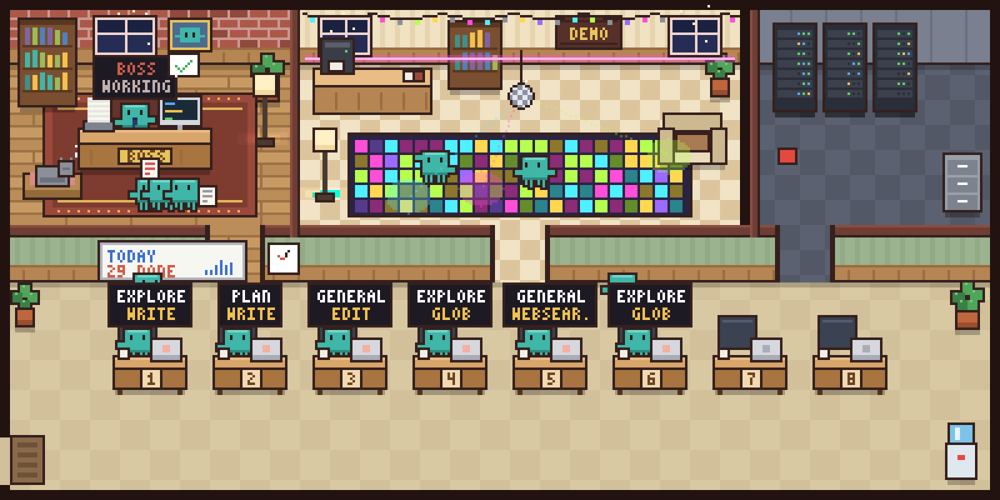
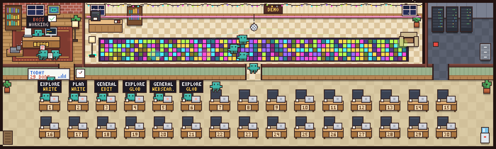
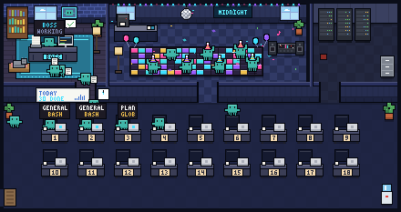
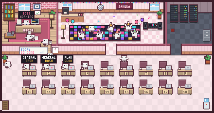
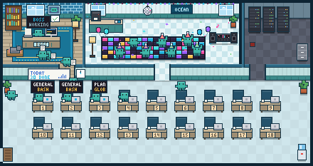
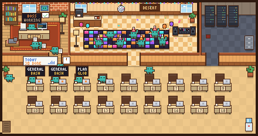
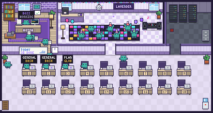
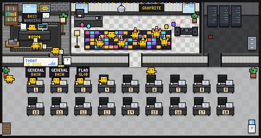
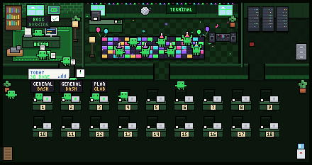
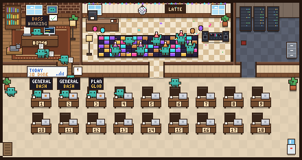

# Agent Office

**An 8-bit pixel-art office for Claude Code: watch your subagents walk in, get to work and deliver to the boss.**



Every subagent Claude spawns walks in as a little bot, sits at a numbered desk showing its agent type and the tool it is using right now, and walks the result over to the boss's desk when it is done. The boss (the main Claude) shows whether it is busy or waiting for you, and the whiteboard counts today's deliveries.

## Features

- **Live subagents.** One desk per running subagent, labelled with its type (Explore, general, code-review, ...) and current tool (Bash, Grep, Write, ...).
- **Deliveries.** Finished agents carry their result to the boss; the whiteboard keeps today's tally (deliveries since local midnight, across all sessions, including ones that already ended; kept in `~/.claude/agent-office/today.json`).
- **Full-window mode** (Ghostty on macOS, kitty, WezTerm): the office opens as a split next to your Claude terminal, with a live feed of the conversation and a task line to send Claude new work.
- **Band mode** (any terminal with the kitty graphics protocol): the office is drawn inside Claude Code, right above the prompt.
- **One office per project.** The wall sign and title show the project folder name, and the colors are generated from it. Custom themes are supported.
- **Several projects and Claude accounts at once?** That is the [Agent Office app](../README.md) for macOS: one terminal per project, one shared office for all of them, and a Claude account picked per project. It bundles this plugin.
- **English or Turkish** UI, picked from your locale.
- **Local only.** No network, no dependencies.

## Install

In Claude Code:

```
/plugin marketplace add isisever/agent-office
/plugin install agent-office@agent-office
```

The part after `@` is the marketplace name (`agent-office`, from `.claude-plugin/marketplace.json`).

To try it from a local checkout instead:

```sh
claude --plugin-dir /path/to/agent-office/plugin
# or
CLAUDE_CODE_PLUGIN_DIRS=/path/to/agent-office/plugin claude
```

## Usage

| Command / key | What it does |
| --- | --- |
| `/office` | Ghostty on macOS, kitty (with remote control) or WezTerm: opens the office as a split next to the Claude terminal. Elsewhere it falls back to `/office band`. |
| `/office band` (alias `/office şerit`) | Toggles the office band inside Claude Code, right above the prompt. |
| `/office stats` (alias `/office istatistik`) | Replies with today's summary as text, without opening a view (see below). |
| Type + `Enter` (full-window office) | Sends the task line to Claude. |
| `Ctrl-C` (full-window office) | Closes the office. |
| `Ctrl-T` (full-window office) | Toggles demo mode. |

### Full-window mode

`/office` splits the current terminal window. The office part shows:

- the office scene,
- a live feed of the Claude conversation, read from the local session transcript: your prompts (`›`), Claude's replies (`●`) and tool calls (`⎿`),
- a **Task** line: type a task and press Enter to send it to Claude.

The Claude terminal keeps a small part of the window. Permission prompts still appear there, so answer them in the Claude terminal.

- **Ghostty** (macOS): the office opens above and the Claude terminal shrinks to about 8 rows at the bottom. The first time, macOS may ask you to let Claude Code control Ghostty (AppleScript automation).
- **kitty**: needs remote control (`allow_remote_control yes` and `listen_on` in `kitty.conf`, or start kitty with `-o allow_remote_control=yes`). The office opens with `kitty @ launch --location=hsplit` below Claude and takes about 80% of the window; the split needs kitty's `splits` layout (in other layouts it opens as a normal kitty window). Without remote control `/office` falls back to the band.
- **WezTerm**: the office opens above with `wezterm cli split-pane --top` and takes about 80% of the window. The `wezterm` command must be on your PATH.

### Today in text: `/office stats`

`/office stats` answers right in the conversation with today's numbers across all your Claude Code sessions (ended ones included): deliveries, failures, total agent time, a line per project, the last five deliveries with their type, description and duration, the agents working right now and the background shells still running.

```
Agent Office · today (2026-10-10)
Delivered: 4 (1 failed) · agent time 13m 0s
+1 more without details (older plugin version)
  api: 2 · 12m 0s
  web: 1 · 1m 0s
Last deliveries:
  14:16 ✗ general-purpose · Fix the bug · 10m 0s (api)
  14:16 ✓ Explore · Scan the code · 2m 0s (api)
  13:17 ✓ Plan · Plan the release · 1m 0s (web)
Working now: 2 · Explore "Map the routes" (api), general-purpose "Write the docs" (my-app)
Background shells running: 1 · npm run dev (api)
```

It reads the session files in `~/.claude/agent-office/sessions/` (each one's daily delivery log); deliveries made by a plugin version older than the log are counted but not listed.

Inside the [Agent Office app](../README.md) the app window is already the office, so there `/office` only gives this summary: `/office stats` or plain `/office`. `/office band` or a split is not available there; the command says so and points to `/office stats`.

### Band mode



In other terminals `/office` (or `/office band`) draws the office inside Claude Code, in the band just above the prompt. This needs a terminal that supports the kitty graphics protocol, such as Ghostty, kitty or WezTerm. Run the command again to close it.

## Themes

Each project gets its own office: the sign on the wall shows the full project folder name in capitals (a project in `my-app/` gets a `MY-APP` sign and a `MY-APP OFFICE` title) and the palette is derived from that name, so different projects look different at a glance.

To pick your own look, create `~/.claude/agent-office/themes.json`:

```json
{
  "acme": {
    "match": "acme",
    "title": "ACME HQ",
    "sign": "ACME",
    "colors": { "accent": "#ff8800", "frame": "#101820" }
  }
}
```

- `match`: case-insensitive substring of the project folder name.
- `title`, `sign`: optional; the window title and the text on the wall sign.
- `colors`: any color key of the viewer's palette (`C` in `viewer/core.mjs`), as `#rrggbb`. Useful ones: `accent`, `frame`, `wallTop`, `brick`, `rugRed`, `bossChair`, `signGreen`, `statusBg`, `statusText`.

Ready-made palettes are in the [theme gallery](#theme-gallery) below.

If `themes.json` cannot be parsed, the office keeps running with the default themes and tells you why: a warning on stderr for snapshots and the band, and a short notice on the bottom line of the full-window office.

## Theme gallery

Eight ready themes live in [`themes/`](../themes) at the root of the repository, one small JSON file each:

| | |
| --- | --- |
| **midnight**: night shift, deep navy rooms, cyan neon and a dark carpet<br> | **sakura**: cherry blossom, soft pink walls, rose brick and light birch desks<br> |
| **ocean**: seaside, aqua carpet, navy tile wall and driftwood desks<br> | **desert**: terracotta and sand, warm adobe walls, orange accents<br> |
| **lavender**: lavender field, lilac carpet, purple walls and pale wood<br> | **graphite**: monochrome concrete greys, black desks, one yellow accent<br> |
| **terminal**: green phosphor, a black-screen office lit by a CRT<br> | **latte**: coffee house, espresso brick, caramel walls and a latte carpet<br> |

To use one, merge its file into `~/.claude/agent-office/themes.json` (the file's top-level key is the theme's name) and set `match` to part of your project folder name; `sign` and `title` can be changed too, and `description` is only for the gallery. From a checkout of this repository:

```sh
node -e '
const fs = require("fs"), path = require("path"), file = path.join(require("os").homedir(), ".claude/agent-office/themes.json")
const mine = fs.existsSync(file) ? JSON.parse(fs.readFileSync(file, "utf8")) : {}
fs.mkdirSync(path.dirname(file), { recursive: true })
fs.writeFileSync(file, JSON.stringify({ ...mine, ...JSON.parse(fs.readFileSync(process.argv[1], "utf8")) }, null, 2))
' themes/sakura.json
```

then edit `match` in `themes.json`. To try a theme without matching a project, start the viewer with `--theme <name>` (for example `node viewer/office.mjs --demo --theme sakura`). The previews are drawn by `node plugin/viewer/gallery.mjs` from the repository root.

## Language

The UI is in Turkish when your locale (the first non-empty of `LC_ALL`, `LC_MESSAGES`, `LANG`) starts with `tr`, and in English otherwise. To pick one regardless of the locale, set `language` in `settings.json` (below).

## Settings

Optional, in `~/.claude/agent-office/settings.json`; both the plugin and the viewer read it:

```json
{
  "language": "en",
  "forgetMinutes": 5
}
```

- `language`: `"tr"`, `"en"` or `"auto"` (default: follow the locale, see Language).
- `forgetMinutes`: how long a bot that delivered its work stays in the office, 1 to 60 minutes (default 5). It parties for this time minus 30 seconds, then leaves.
- `botColor`: the bots' color as `"#rrggbb"` (default `"#3fb6a8"`). In the app, pick it under **Bot rengi** in the sidebar instead.

A missing or invalid file, or an invalid value, falls back to the defaults. Restart the session and reopen the office after changing it.

## Privacy

Everything stays on your machine, under `~/.claude/agent-office/`:

| Path | Contents |
| --- | --- |
| `sessions/` | Office state per Claude Code session (agents, desks, deliveries) |
| `inbox/` | Tasks typed into the office's task line, waiting for Claude |
| `frames/` | Rendered frames for band mode |

These files clean up after themselves. Each submitted task is removed from the inbox right away. When a session starts, the plugin deletes the `sessions/`, `inbox/` and `frames/` files of other sessions that have ended or have not been updated for a day. It never deletes the files of the current session or of another session that is still running.

A line in `inbox/<session>.jsonl` reaches Claude as if you had typed it. Anything that can write there already runs as your user and could start `claude` itself, so the inbox adds no new access; it is created with your normal file permissions, like the rest of `~/.claude`.

The conversation feed is read directly from Claude Code's local transcript. Nothing is sent anywhere.

## Requirements

- Claude Code **2.1.295** or newer (plugin hook modules are an early-access feature)
- Node.js **18** or newer
- Full-window mode: **Ghostty** on macOS, **kitty** with remote control enabled, or **WezTerm**
- Band mode: a terminal with the kitty graphics protocol (Ghostty, kitty, WezTerm)

## How it works

1. The plugin's hooks module (`hooks/register.tsx`) listens to Claude Code events: subagents starting, using tools and finishing, and the main session working or waiting. It writes that state to `~/.claude/agent-office/sessions/<session>.json`.
2. The viewer (`viewer/office.mjs`, plain Node, no dependencies) reads the state files and renders the pixel-art office with the kitty graphics protocol (the drawing itself is in `viewer/core.mjs`, shared with the Agent Office app), either full-window in a terminal split (Ghostty, kitty, WezTerm) or as PNG frames that the plugin shows in the band above the prompt.
3. Tasks typed into the office are appended to `~/.claude/agent-office/inbox/`, and the plugin hands them to Claude.

You can run the viewer on its own:

```sh
node viewer/office.mjs --demo                          # demo office with fake agents
node viewer/office.mjs --snapshot out.png 1600x800     # render one demo frame to PNG
```

## Development

```sh
claude plugin validate .   # check the manifest and hooks module
claude plugin test .       # run the tests in tests/
node tests/viewer-smoke.mjs # render the viewer to PNG (needs Node 18+)
claude --plugin-dir .      # try your checkout in a real session
```

`viewer/core.mjs` is the only copy of the drawing code to edit; the app keeps a byte-identical copy in `app/src/office/core.mjs`. After changing it, run `node ../app/scripts/sync-core.mjs` (the app's tests check the two match).

## License

MIT

---

## Türkçe

**Claude Code için 8-bit piksel ofis: alt agent'lar içeri yürür, masalarında çalışır, işi müdüre teslim eder.**

Claude'un başlattığı her alt agent küçük bir bot olarak ofise girer, numaralı bir masaya oturur; masanın üstünde agent tipi ve o an kullandığı araç yazar. İşi bitince sonucu müdürün masasına götürür. Müdür (ana Claude) çalışıyor mu, seni mi bekliyor, görünür; beyaz tahta bugünkü teslimleri sayar.

Aynı anda birkaç projede ve birkaç Claude hesabıyla çalışmak için macOS'taki [Agent Office uygulaması](../README.md) var: her projeye ayrı terminal, hepsine tek ortak ofis, her proje için ayrı seçilen Claude hesabı. Bu eklenti uygulamanın içinde gelir.

### Kurulum

```
/plugin marketplace add isisever/agent-office
/plugin install agent-office@agent-office
```

Yerel kopyadan denemek için: `claude --plugin-dir /yol/agent-office/plugin`

### Kullanım

| Komut / tuş | Ne yapar |
| --- | --- |
| `/office` | macOS'ta Ghostty, (uzaktan kontrolü açık) kitty ya da WezTerm: ofisi Claude terminalinin yanında bölme olarak açar. Diğer terminallerde `/office şerit`'e düşer. |
| `/office şerit` (ya da `/office band`) | Ofisi Claude Code içinde, prompt'un hemen üstündeki şeritte açar/kapatır. |
| `/office istatistik` (ya da `/office stats`) | Görünüm açmadan bugünün özetini metin olarak verir: tüm oturumlardaki teslimler (sayı, başarısız, toplam agent süresi, proje başına, son teslimler: tip, açıklama, süre), şu an çalışan agent'lar ve çalışan arka plan komutları. [Agent Office uygulamasının](../README.md) içinde ofis zaten uygulama penceresindedir: orada `/office` yalnız bu özeti verir (`/office istatistik` ya da yalnız `/office`); şerit ve bölme açılmaz. |
| Yaz + `Enter` (tam pencere ofis) | Görev satırındaki görevi Claude'a gönderir. |
| `Ctrl-C` (tam pencere ofis) | Ofisi kapatır. |

Tam pencere modunda üstte ofis sahnesi, Claude konuşmasının canlı akışı (istemler `›`, cevaplar `●`, araç çağrıları `⎿`) ve **Görev** satırı bulunur. Claude terminali pencerenin küçük bir kısmında kalır; izin sorularını orada cevaplarsın. Ghostty'de ofis üstte açılır, Claude altta yaklaşık 8 satıra iner. kitty'de uzaktan kontrol gerekir (`kitty.conf` içinde `allow_remote_control yes` ve `listen_on`); ofis `kitty @ launch --location=hsplit` ile Claude'un altında, pencerenin yaklaşık %80'ini kaplayarak açılır (bölme için `splits` düzeni gerekir). Uzaktan kontrol yoksa `/office` şeride düşer. WezTerm'de ofis `wezterm cli split-pane --top` ile üstte, yaklaşık %80 boyutla açılır (`wezterm` komutu PATH'te olmalı).

Şerit modu kitty grafik protokolünü destekleyen bir terminal ister (Ghostty, kitty, WezTerm).

Her projenin kendi ofisi vardır: duvardaki tabela proje klasörünün adını gösterir, renkler bu addan üretilir. Kendi temanı `~/.claude/agent-office/themes.json` ile tanımlayabilirsin (yukarıdaki Themes bölümüne bak). Depo kökündeki [`themes/`](../themes) klasöründe sekiz hazır tema var (midnight, sakura, ocean, desert, lavender, graphite, terminal, latte; önizlemeler yukarıdaki Theme gallery bölümünde): birinin dosyasını `themes.json`'a birleştirip `match`'i proje klasörünün adına göre değiştirmen yeterli. Dosya bozuksa ofis varsayılan temalarla açılır ve hatayı gösterir. Beyaz tahtadaki BUGÜN sayısı yerel gece yarısından beri tüm oturumlardaki (bitenler dahil) teslimleri sayar. Arayüz, yerel ayarın `tr` ile başlıyorsa Türkçedir. Tüm veriler `~/.claude/agent-office/` altında, makinende kalır; hiçbir yere gönderilmez. Gelen kutusuna (`inbox/<oturum>.jsonl`) yazılan satır Claude'a senin yazmışsın gibi gider; oraya yazabilen bir süreç zaten senin kullanıcınla çalışır ve `claude`'u kendisi de başlatabilir, yani gelen kutusu yeni bir erişim açmaz. Bu dosyalar kendiliğinden temizlenir: gönderilen görev gelen kutusundan hemen silinir. Her oturum açılışında eklenti, bitmiş ya da bir gündür güncellenmemiş diğer oturumların `sessions/`, `inbox/` ve `frames/` dosyalarını siler. Açık olan oturumun ve hâlâ çalışan başka bir oturumun dosyalarına dokunmaz.

İsteğe bağlı ayarlar `~/.claude/agent-office/settings.json` dosyasındadır; eklenti de görüntüleyici de okur: `{ "language": "tr", "forgetMinutes": 5 }`. `language`: `"tr"`, `"en"` ya da `"auto"` (varsayılan; yerel ayara göre). `forgetMinutes`: teslim eden botun ofiste kalma süresi, 1-60 dakika (varsayılan 5); bu sürenin 30 saniye eksiği parti yapar, sonra çıkar. `botColor`: botların rengi, `"#rrggbb"` (uygulamada kenar çubuğundaki **Bot rengi** ile seçilir). Dosya yoksa ya da geçersizse varsayılanlar kullanılır. Değiştirdikten sonra oturumu yeniden başlatıp ofisi yeniden aç.

Gereksinimler: Claude Code 2.1.295+, Node.js 18+, tam pencere için macOS'ta Ghostty, uzaktan kontrolü açık kitty ya da WezTerm.
